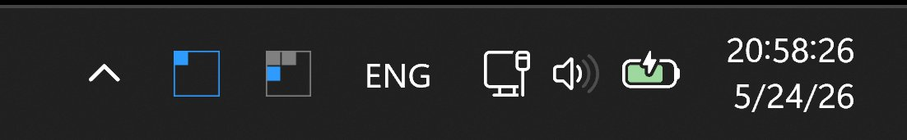

#  komorebi-tray-grid

A tiny Windows system-tray indicator for the [komorebi](https://github.com/LGUG2Z/komorebi) tiling
window manager. Each tray icon is a 3×3 grid that mirrors the state of the nine workspaces on a
single monitor; when multiple monitors are connected, one tray icon is created per monitor.



Per-cell visuals:

| Cell state                                  | Appearance                                   |
| ------------------------------------------- | -------------------------------------------- |
| empty workspace                             | transparent (no fill)                        |
| workspace with 1 window                     | dim gray fill                                |
| workspace with 2 windows                    | medium gray fill                             |
| workspace with 3+ windows                   | light gray fill                              |
| focused workspace                           | bright blue fill (overrides gray tiers)      |
| workspace contains a full-screen container  | yellow border (composes with the fill above) |

Right-clicking any tray icon opens the same menu, with:

- **Enable autostart** — toggle a per-user `HKCU\Software\Microsoft\Windows\CurrentVersion\Run`
  entry pointing at the running executable, so the app launches on logon.
- **Quit** — terminate the app and remove all tray icons.

See [`spec.md`](spec.md) for the original spec and [`plan.md`](plan.md) for the design plan.

## Status

Early but functional. The MVP described in [`spec.md`](spec.md) is implemented end-to-end —
renderer, komorebi event worker, per-monitor tray icons, right-click menu with the autostart
toggle, single-instance guard, and a CI-built NSIS installer — and tagged as `v0.2.2`. See the
[releases page](https://github.com/h0tk3y/komorebi-tray-grid/releases) for prebuilt binaries.
Expect rough edges; bug reports and PRs are welcome.

## Build

Prerequisites:

- Windows 10 or 11
- The pinned Rust toolchain from [`rust-toolchain.toml`](rust-toolchain.toml) (currently `1.90.0`,
  `x86_64-pc-windows-msvc` target). With [`rustup`](https://rustup.rs) installed, the toolchain
  is picked up automatically on the first `cargo` invocation in this directory.

```powershell
# Debug build
cargo build

# Release build (this is what CI ships)
cargo build --release --locked

# Run the tests (renderer + komorebi state mapping)
cargo test --locked
```

The release binary lands at `target\release\komorebi-tray-grid.exe`.

### App icon

The Windows resource compiler embeds `assets\app.ico` as the exe's Explorer / Alt-Tab
icon, and the same file is used by the NSIS installer (see below). It is generated
on demand from the in-process renderer so it always matches the tray's visual style:

```powershell
# Regenerate assets\app.ico and docs\icon.png.
cargo run --example gen_icon
```

The files are committed to the repository, so a fresh checkout builds without
running this step first; build still works (without an icon) even if you
delete `assets\app.ico` and `docs\icon.png`.

### Windows installer

A signed-able NSIS installer can be built with
[`cargo-packager`](https://github.com/crabnebula-dev/cargo-packager):

```powershell
# One-time setup
cargo install cargo-packager --locked

# Build the installer (.exe). Runs `cargo build --release --locked` internally.
cargo packager --release
```

The resulting `komorebi-tray-grid_<version>_x64-setup.exe` lands in
`target\packager\`. The installer is **per-user only** (`%LOCALAPPDATA%\Programs\…`,
no UAC elevation): the app communicates with komorebi over an AF_UNIX socket at
the user's integrity level, and an elevated install would auto-launch the app
with a High-IL token that komorebi (Medium-IL) cannot write events into.

Installer settings live under `[package.metadata.packager]` in
[`Cargo.toml`](Cargo.toml); to additionally build a `.msi`, add
`"wix"` to the `formats` array.

## Run

`komorebi` must be installed and running. Start komorebi as usual, then launch:

```powershell
.\target\release\komorebi-tray-grid.exe
```

The app talks to komorebi directly over its AF_UNIX socket via the
[`komorebi-client`](https://github.com/LGUG2Z/komorebi/tree/master/komorebi-client) crate, so
`komorebic.exe` doesn't need to be on `PATH`. On startup it:

1. Acquires a `Global\komorebi-tray-grid` named mutex so only one instance can run.
2. Queries `SocketMessage::State` to seed the initial UI.
3. Calls `komorebi_client::subscribe(<unique name>)` to register a per-process subscriber
   socket under `%LOCALAPPDATA%\komorebi\`.
4. Adds one tray icon per monitor reported by komorebi and updates it on every notification,
   coalescing bursts (~50 ms debounce) into a fresh `State` query.
5. If the subscription breaks, re-subscribes with exponential backoff and re-queries state.

Logs go to stderr; the log level can be tuned with `KOMOREBI_TRAY_LOG`, e.g.
`$env:KOMOREBI_TRAY_LOG = "debug"`.

### Color customization

The app tracks Windows app mode (`AppsUseLightTheme`) and switches colors instantly when
you switch between dark and light mode.

You can override tray colors and configure a global hotkey to show the menu with a per-user config file at:
`%APPDATA%\komorebi-tray-grid\config.json`

On a typical system this resolves to:
`C:\Users\<your-user>\AppData\Roaming\komorebi-tray-grid\config.json`

If the file is missing (or invalid), the app logs a warning and falls back to
the built-in defaults.

```json
{
  "colors": {
    "dark": {
      "focused": "#2E9BFFFF",
      "non_empty_1": "#6B6B6BFF",
      "non_empty_2": "#8C8C8CFF",
      "non_empty_3_plus": "#B0B0B0FF",
      "full_screen_border": "#FFD500FF",
      "active_monitor_border": "#2E9BFFFF",
      "inactive_monitor_border": "#8C8C8CFF",
      "empty": "#00000000"
    },
    "light": {
      "focused": "#0067C0FF",
      "non_empty_1": "#868686FF",
      "non_empty_2": "#6A6A6AFF",
      "non_empty_3_plus": "#4F4F4FFF",
      "full_screen_border": "#C7A000FF",
      "active_monitor_border": "#0067C0FF",
      "inactive_monitor_border": "#6A6A6AFF",
      "empty": "#00000000"
    }
  },
  "menu": {
    "show_hotkey": "Ctrl+Alt+G",
    "max_title_length": 64,
    "max_combined_title_length": 96
  }
}
```

### Menu configuration

The `menu` section allows customizing the tray context menu:

- `show_hotkey` (optional string): A global keyboard shortcut to open the menu.
  - Format: `Modifier+Key` or `Modifier+Modifier+Key`.
  - Supported modifiers: `Ctrl`, `Alt`, `Shift`, `Win`.
  - Supported keys: `A`-`Z`, `0`-`9`, `F1`-`F12`.
  - Examples: `Ctrl+Shift+K`, `Alt+F1`, `Win+Alt+G`.
  - If you have multiple monitors, pressing the hotkey repeatedly will cycle the menu across each monitor's tray icon.
- `max_title_length` (optional integer, default `64`): Maximum length of an individual window title before it's ellipsized.
- `max_combined_title_length` (optional integer, default `96`): Maximum length of the joined string of all window titles in a workspace menu item.

`colors.non_empty` has been removed and is no longer used.
All keys are under `colors.dark` and `colors.light`.

Supported formats are `#RRGGBB` (alpha defaults to `FF`) and `#RRGGBBAA`.

## Releases

Prebuilt binaries are published on the
[GitHub releases page](https://github.com/h0tk3y/komorebi-tray-grid/releases).

Tagged pushes (`v*`) trigger
[`.github/workflows/release.yml`](.github/workflows/release.yml), which builds on
`windows-latest`, runs tests, and uploads both a zipped portable `.exe` and the
NSIS `*-setup.exe` installer as release assets.
