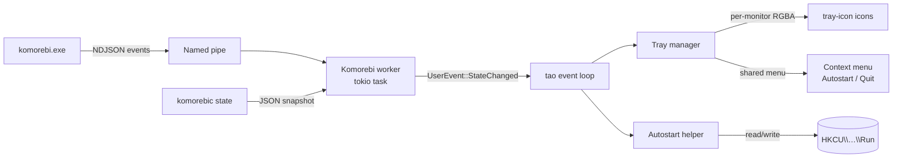

# Requirements

### Overview & Goals
Build a small Rust desktop app for Windows that lives in the system tray and visualizes the state of the [komorebi](https://github.com/LGUG2Z/komorebi) tiling window manager. The tray icon is a 3×3 grid; each cell corresponds to a komorebi workspace (0..8, row-major from the top-left) and is colored according to that workspace's state. When multiple monitors are present, one tray icon is shown per monitor, each reflecting its own monitor's workspaces.

### Scope
#### In Scope
- Single Windows executable written in Rust.
- One tray icon per komorebi monitor.
- 3×3 grid icon rendered dynamically, redrawn on every state change.
- Per-cell visual states:
  - focused → bright blue fill;
  - has a full-screen container → purple border (composes with focused);
  - non-empty → gray fill;
  - empty → transparent (no fill).
- Per-icon visual state (multi-monitor only):
  - icon belongs to the currently focused monitor → 1 px outer highlight border around the whole 3×3 grid; absent for the inactive monitor(s) and for the single-monitor case.
- Live updates via komorebi's named-pipe event subscription (`komorebic subscribe-pipe <name>`).
- Bootstrap via `komorebic state` JSON for the initial state and as a fallback re-sync.
- Right-click context menu (identical on every tray icon) with:
  - `Enable autostart` (toggle / checkmark);
  - `Quit`.
- Autostart on Windows logon (per-user) when enabled.
- Reproducible release build + distribution artifact via CI.

#### Out of Scope
- Linux/macOS support (komorebi is Windows-only).
- Configurable colors, icon size or layout (hard-coded per spec for v1).
- More than 9 workspaces, or grids other than 3×3.
- Click-to-focus or other interactive controls beyond the context menu.
- Localization.

### User Stories
- As a komorebi user, I want to see at a glance which workspace is focused on each monitor so I can orient myself without opening any UI.
- As a komorebi user, I want to see which workspaces have windows so I know where my apps live.
- As a komorebi user, I want to know when a workspace is in full-screen/maximize mode without having to switch to it.
- As a multi-monitor user, I want a separate tray icon per monitor so each monitor's state is visible simultaneously.
- As a user, I want the app to launch automatically at logon so I don't have to start it manually.

### Functional Requirements
1. On startup, the app:
   - creates a uniquely named Windows named pipe;
   - invokes `komorebic.exe subscribe-pipe <pipe-name>` to register for events;
   - invokes `komorebic.exe state` and parses the JSON to seed initial state.
2. For each monitor reported by komorebi, the app creates exactly one tray icon; on monitor add/remove, icons are added/removed accordingly. When more than one monitor is reported, the icon for the currently focused monitor is also decorated with a 1 px outer highlight border (same blue as the focused-cell fill).
3. Each tray icon's image is a 3×3 grid where cell `i` (row-major, 0..8) represents workspace `i` on that monitor. Workspaces beyond what komorebi reports are rendered as empty.
4. Visual states (spec, exact):
   - empty → transparent cell;
   - non-empty → gray fill;
   - focused → bright blue fill (overrides gray);
   - any container is full-screen/maximize → purple border on top of the current fill.
5. Right-clicking any tray icon shows the same menu; left/double click is a no-op for v1.
6. `Enable autostart` reflects current state on open and toggles a per-user `HKCU\Software\Microsoft\Windows\CurrentVersion\Run` registry entry pointing to the running executable path.
7. `Quit` exits cleanly: closes the named pipe, removes tray icons, terminates the process.
8. The app must keep running across komorebi restarts: if the pipe breaks, it re-subscribes with exponential backoff and re-queries state.

### Non-Functional Requirements
- Idle CPU: negligible (event-driven; no polling loop except backoff on reconnect).
- Memory: a few MB; one small RGBA buffer per monitor for the rendered icon.
- Startup-to-first-icon: < 500 ms on a typical machine after `komorebic state` returns.
- Single instance: a second launch should detect an existing instance and exit (prevents duplicate icons).
- Reproducible builds: pinned Rust toolchain (`rust-toolchain.toml`), committed `Cargo.lock`, CI that builds release artifacts.

# Technical Design

### Current Implementation
The repository contains only `spec.md` and an empty `.junie/` workspace folder — there is no prior code to extend. Everything will be created from scratch as a new Cargo project.

### Key Decisions
- **Language / toolchain**: Rust stable, pinned in `rust-toolchain.toml` (e.g. `1.82.0`), Windows-only target (`x86_64-pc-windows-msvc`).
- **Tray + event loop**: [`tray-icon`](https://crates.io/crates/tray-icon) (Tauri ecosystem) on top of [`tao`](https://crates.io/crates/tao). Reasons: actively maintained, supports multiple icons in one process, dynamic image updates from raw RGBA buffers, and per-icon menus driven through a single event loop.
- **Icon rendering**: pure CPU rasterization into a small RGBA buffer (e.g. 32×32 or 64×64 — pick the larger size that Windows scales nicely; `tray-icon` accepts raw RGBA). No external image files at runtime — everything is drawn from code, which keeps the binary self-contained and the visual style trivially tweakable.
- **Komorebi integration**: use the documented pipe subscription. Read newline-delimited JSON via `tokio`'s `NamedPipeServer` running on a dedicated tokio current-thread runtime in a worker thread; forward parsed state to the UI thread via a `tao` user-event channel (`EventLoopProxy::send_event`).
- **State-update strategy**: rather than attempting to model every komorebi event variant, the worker re-queries `komorebic state` whenever an event arrives (or, if the event payload already carries the full state — komorebi includes it in newer versions — use it directly). This is robust to komorebi schema evolution and matches the spec's hint that `komorebic state` is the canonical source. Updates are debounced (~50 ms) to coalesce bursts.
- **Autostart**: per-user registry write under `HKCU\Software\Microsoft\Windows\CurrentVersion\Run\komorebi-tray-grid`, using the `windows-registry` (or `winreg`) crate. Avoids needing admin rights or the Startup folder. The menu reads the current value to display the correct checked state.
- **Tray Menu Hierarchy**: Workspaces are represented in a two-tier menu system using "virtual submenus" by default. This behavior is configurable via `workspace_submenus` in `config.json`. Clicking a workspace in the main Workspace Menu opens a separate Window Menu for that workspace. These menus use keyboard mnemonics (digits 1-9) for quick navigation. The "Focus Workspace" item in the Window Menu is automatically highlighted to allow immediate switching via the Enter key. Window items use the system HWND for reliable focusing in multi-window applications.
- **Single-instance**: named mutex via `CreateMutexW` (`Global\komorebi-tray-grid`); if already held, the second instance exits silently.
- **Distribution**: GitHub Actions workflow (`windows-latest`) producing a zipped portable `komorebi-tray-grid.exe` from `cargo build --release`. Optional MSI via `cargo-wix` is a stretch goal but not v1.

### Proposed Changes
Create a new Cargo binary crate with the following modules:

- `main.rs` — entry point: single-instance check, set up logging, build `tao` event loop, spawn komorebi worker, run loop.
- `app.rs` — high-level `App` struct holding the event loop proxy, current `WorldState`, the map of `MonitorId → TrayIconHandle`, and the menu. Handles `UserEvent::StateChanged` and reconciles tray icons.
- `komorebi/mod.rs` — public types and the worker entry point.
- `komorebi/types.rs` — `serde` structs mirroring the subset of `komorebic state` we consume (`State { monitors: Elements<Monitor> }`, `Monitor { workspaces: Elements<Workspace>, focused_workspace_idx }`, `Workspace { containers: Elements<Container>, maximized_window, monocle_container, … }`).
- `komorebi/pipe.rs` — async loop that creates the named pipe, runs `komorebic subscribe-pipe`, reads NDJSON lines, and emits coalesced `WorldState` snapshots.
- `komorebi/state.rs` — derives a simplified per-monitor `[CellState; 9]` from the raw komorebi state.
- `render.rs` — pure function `fn render_grid(cells: &[CellState; 9], size: u32) -> Vec<u8>` returning RGBA. Draws cells, fills, and a 2 px purple border where requested. No external dependencies beyond `image` (or hand-rolled, since the geometry is trivial).
- `tray.rs` — wraps `tray-icon` and the menu, exposes `set_grid(monitor_id, cells)`, `add_monitor`, `remove_monitor`, `set_autostart_checked(bool)`.
- `autostart.rs` — `is_enabled()`, `enable()`, `disable()` against `HKCU\…\Run`.
- `single_instance.rs` — RAII wrapper around `CreateMutexW`.

### Data Models / Contracts
```rust
// komorebi/state.rs
#[derive(Copy, Clone, Eq, PartialEq, Debug, Default)]
pub struct CellState {
    pub focused: bool,
    pub non_empty: bool,
    pub full_screen: bool, // any maximized window or monocle container in the workspace
}

#[derive(Clone, Debug, Default)]
pub struct MonitorState {
    pub id: String,          // komorebi monitor device id, used as map key
    pub cells: [CellState; 9],
}

#[derive(Clone, Debug, Default)]
pub struct WorldState {
    pub monitors: Vec<MonitorState>, // order matches komorebi's order
}

pub enum UserEvent {
    StateChanged(WorldState),
    AutostartToggled,
    Quit,
}
```

```rust
// render.rs
pub const ICON_SIZE: u32 = 32;
pub const COLOR_FOCUSED: [u8; 4]  = [0x2E, 0x9B, 0xFF, 0xFF];
pub const COLOR_NON_EMPTY: [u8; 4] = [0x80, 0x80, 0x80, 0xFF];
pub const COLOR_BORDER_FS: [u8; 4] = [0xA0, 0x40, 0xFF, 0xFF];

pub fn render_grid(cells: &[CellState; 9]) -> Vec<u8> { /* RGBA, length = 4*ICON_SIZE*ICON_SIZE */ }
```

### Components
- **App / event loop** — owns lifecycle; consumes `UserEvent`s.
- **Komorebi worker** — owns the pipe and child `komorebic` calls; emits `WorldState`.
- **Renderer** — pure function, easy to unit-test with snapshot pixel checks.
- **Tray manager** — translates `WorldState` diffs into `tray-icon` operations; owns shared `Menu`.
- **Autostart** — registry helper, called by the menu handler and by the menu builder to display checked state.

### File Structure
```
komorebi-tray-grid/
├── Cargo.toml
├── Cargo.lock                       # committed for reproducibility
├── rust-toolchain.toml              # pinned stable toolchain
├── .github/workflows/release.yml    # CI build + zipped release artifact
├── build.rs                         # sets Windows subsystem (no console), embeds manifest
├── app.manifest                     # DPI awareness, no UAC elevation
├── src/
│   ├── main.rs
│   ├── app.rs
│   ├── tray.rs
│   ├── render.rs
│   ├── autostart.rs
│   ├── single_instance.rs
│   └── komorebi/
│       ├── mod.rs
│       ├── types.rs
│       ├── pipe.rs
│       └── state.rs
├── plan.md                          # this plan, persisted
├── spec.md                          # existing
└── README.md                        # short usage + build instructions
```

### Architecture Diagram


### Risks
- **Komorebi schema drift**: the JSON shape may change between versions. Mitigation: deserialize only the fields we use with `#[serde(default)]`, and treat unknown variants gracefully.
- **Pipe lifecycle**: if komorebi restarts, our pipe peer disappears. Mitigation: detect EOF / broken pipe, recreate pipe, re-subscribe with backoff.
- **Monitor identity stability**: komorebi may renumber monitors on hot-plug. We key tray icons by the monitor's device id string from `komorebic state` rather than by index, and reconcile by diffing.
- **Tray icon scaling on hi-DPI**: Windows scales the 32×32 RGBA bitmap. If artifacts appear, bump to 64×64 — `tray-icon` accepts any square size.
- **CI runner cost / availability**: GitHub `windows-latest` is required for `windows-msvc` builds; standard runner is sufficient.

# Testing

### Validation Approach
Most of the value lives in two pure pieces — komorebi-state → cell-state mapping, and cell-state → RGBA rendering — both of which are deterministic and easily unit-tested. End-to-end behavior is validated manually against a running komorebi instance because it depends on Windows + komorebi being installed.

### Key Scenarios
- A workspace with at least one container renders as gray.
- Focusing a workspace makes its cell bright blue regardless of emptiness.
- A workspace containing a maximized window or a monocle container renders with the purple border; combining with focus yields blue fill + purple border.
- An empty workspace, and any workspace index ≥ number of komorebi workspaces, renders as a transparent cell.
- Two monitors → two distinct tray icons, each reflecting only its own monitor's workspaces.
- Toggling `Enable autostart` from the menu writes/removes the `HKCU\…\Run\komorebi-tray-grid` value, and the checkmark reflects the state on next menu open.
- `Quit` exits the process and removes all tray icons.

### Edge Cases
- komorebi is not installed / not on `PATH` → app logs a clear error and exits non-zero (no silent failure).
- komorebi is running but pipe is closed mid-session → worker reconnects with exponential backoff and re-syncs via `komorebic state`.
- Burst of events (e.g. workspace shuffles) → coalescing (~50 ms debounce) renders the icon at most once per burst.
- Monitor unplugged → its tray icon disappears within one update cycle.
- A second instance is started → detects the named mutex and exits silently with code 0.
- Komorebi reports more than 9 workspaces → cells 0..8 are rendered, extras are ignored (documented).

### Test Changes
- `tests/render.rs` — snapshot tests for `render_grid` for representative cell combinations (empty, gray, blue, gray+border, blue+border). Snapshots stored as PNGs and compared byte-wise (or via `insta`).
- `tests/state_mapping.rs` — feed sample `komorebic state` JSON fixtures (committed under `tests/fixtures/`) into the parser and assert the resulting `[CellState; 9]` per monitor.
- No async / integration tests around the named pipe in v1 — covered by manual validation.

# Delivery Steps

### ✓ Step 1: Scaffold Cargo project and reproducible-build setup
A buildable, empty Windows-subsystem Rust binary exists with pinned toolchain and committed lockfile.

- Create `Cargo.toml` for a binary crate `komorebi-tray-grid` targeting Windows; add dependencies: `tao`, `tray-icon`, `tokio` (rt + macros + net), `serde`, `serde_json`, `windows` (Win32_Foundation, Win32_System_Threading, Win32_System_Registry), `image` (optional, for snapshot tests), `anyhow`, `tracing`, `tracing-subscriber`.
- Add `rust-toolchain.toml` pinning a specific stable Rust version and `x86_64-pc-windows-msvc` target.
- Add `build.rs` and `app.manifest` to set the Windows subsystem (no console window) and per-monitor DPI awareness; embed an app icon placeholder.
- Commit `Cargo.lock`.
- Add a `.github/workflows/release.yml` running on `windows-latest` that does `cargo build --release` and uploads `target/release/komorebi-tray-grid.exe` as a zipped artifact on tag pushes.
- Add a minimal `src/main.rs` that initializes logging and exits, so the workflow has something to compile.
- Add `README.md` with build and run instructions.
- Persist the approved plan to `plan.md` at the project root (mirroring the content of `.junie/plans/komorebi-tray-grid-mvp.md`) so the design is checked into the repo alongside `spec.md`.

### ✓ Step 2: Implement icon rendering and unit tests
`render::render_grid` deterministically produces RGBA bytes for a 3×3 grid, fully covered by snapshot tests.

- Create `src/render.rs` with `CellState`, color constants (focused blue, gray, full-screen purple), and `ICON_SIZE` constant.
- Implement `render_grid(cells: &[CellState; 9]) -> Vec<u8>` that fills cells per the spec and overlays a 2 px purple border where `full_screen` is set, leaving empty cells fully transparent.
- Add `tests/render.rs` with snapshot tests for: all-empty, single focused, single non-empty, focused+full-screen, non-empty+full-screen, mixed grid.
- Store reference PNGs under `tests/fixtures/render/` and compare byte-wise; document how to regenerate them.

### ✓ Step 3: Implement komorebi state model, parsing, and event worker
An async worker subscribes to komorebi and emits coalesced `WorldState` snapshots to the UI thread.

- Create `src/komorebi/types.rs` with `serde` structs for the subset of `komorebic state` we consume (`State`, `Monitor`, `Workspace`, `Container`, monitor id, focused index, maximized/monocle markers). Use `#[serde(default)]` aggressively.
- Create `src/komorebi/state.rs` with `WorldState`, `MonitorState`, and a `From<types::State>` mapping that derives `[CellState; 9]` per monitor (focused, non-empty, full-screen flags) and pads missing workspaces as empty.
- Create `src/komorebi/pipe.rs`: tokio task that creates a uniquely named `NamedPipeServer`, spawns `komorebic subscribe-pipe <name>`, reads NDJSON, and on every event re-runs `komorebic state`, parses it, and sends a `WorldState` via an `EventLoopProxy<UserEvent>`. Debounce with a ~50 ms timer to coalesce bursts. Reconnect with exponential backoff on broken pipe.
- Add `tests/state_mapping.rs` with committed JSON fixtures covering: single monitor, multi-monitor, full-screen / monocle, empty trailing workspaces.

### ✓ Step 4: Wire up tao event loop, multi-monitor tray icons, and context menu
Running the app shows one tray icon per komorebi monitor, each live-updated, all sharing the same right-click menu.

- Create `src/app.rs` with the `App` struct (event-loop proxy, current `WorldState`, `HashMap<MonitorId, TrayIcon>`, shared `Menu`).
- Create `src/tray.rs` wrapping `tray-icon`: builds icons from raw RGBA produced by `render::render_grid`, attaches the shared menu, and exposes `reconcile(world: &WorldState)` to add/update/remove icons by monitor id.
- Build the shared context menu with `Enable autostart` (checkable) and `Quit` items.
- In `src/main.rs`, perform the single-instance check, build the tao `EventLoop<UserEvent>`, spawn the komorebi worker on a dedicated tokio runtime thread, and run the loop: on `StateChanged` call `tray::reconcile`, on menu events dispatch to autostart/quit handlers.

### ✓ Step 5: Implement single-instance guard and autostart toggle
Only one instance can run, and autostart can be toggled from any tray icon's menu with the correct checkmark state.

- Create `src/single_instance.rs`: RAII handle around `CreateMutexW("Global\\komorebi-tray-grid")`; if `GetLastError() == ERROR_ALREADY_EXISTS`, exit with code 0 from `main`.
- Create `src/autostart.rs` with `is_enabled() -> bool`, `enable() -> Result<()>`, `disable() -> Result<()>` against `HKCU\Software\Microsoft\Windows\CurrentVersion\Run\komorebi-tray-grid`, storing the current `std::env::current_exe()` path quoted.
- On startup and whenever the menu is about to be shown, refresh the `Enable autostart` checkbox from `autostart::is_enabled()`.
- Wire the menu item handler in `app.rs` to toggle and update the checkmark; wire `Quit` to break out of the event loop and drop tray icons cleanly.

### ✓ Step 6: Implement Virtual Submenus and Window-level Focusing
Workspace items in the tray menu trigger a secondary "virtual" menu listing individual windows.

- Implement "Virtual Submenus" logic in `app.rs`: intercepted workspace clicks trigger a new `Menu` specifically for that workspace.
- Include a "Focus Workspace" item at the top of each Window Menu, automatically focused via a keyboard injection trick (`VK_DOWN`) to support immediate `Enter` key switching.
- Implement window focusing using `SetForegroundWindow` with HWNDs retrieved from `komorebi` state.
- Update `spec.md` and `README.md` to document the new two-tier menu interaction and keyboard navigation.

### ✓ Step 7: Introduce `workspace_submenus` configuration
Allow users to toggle the virtual submenu behavior via a configuration key.

- Add `workspace_submenus` (default `true`) to `MenuConfig` and `AppSettings` in `config.rs`.
- Update `App::new` and `build_menu_for_monitor` to respect the `workspace_submenus` flag.
- Update `on_menu_event` to provide a fallback focus-switching behavior when submenus are disabled.
- Update `spec.md` and `README.md` to document the new configuration key.